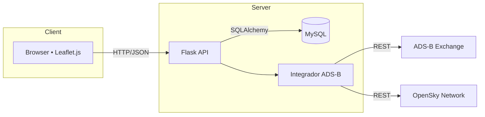

<!-- banner / logo opcional -->
<h1 align="center">
  ADS‑B State Tracker ✈️
</h1>
<p align="center">
  <em>Seguimiento en tiempo real de aeronaves de Estado con integración ADS‑B Exchange + OpenSky y simulación de autorizaciones diplomáticas.</em>
</p>

<p align="center">
  <!-- badge de GitHub Actions -->
  <a href="https://github.com/Garcia082/adsb-state-tracker/actions">
    
  </a>
  <!-- badge de licencia -->
  <a href="LICENSE"></a>
</p>

---

## ✨ Características

- **Backend** Flask + MySQL (contenedorizado con Docker)
- **Integración** en tiempo real con **ADS‑B Exchange** y **OpenSky Network**
- **Filtro automático** de aeronaves de Estado / militares
- **Simulación** de plan de vuelo (casilla 18) para verificar autorizaciones diplomáticas
- **Frontend** interactivo (Leaflet.js) con actualización cada 5 s
- CI automatizada con **GitHub Actions**

## 🖼️ Arquitectura


<!-- fin del diagrama mermaid -->
```

## ⚡ Ejecución rápida (Docker Compose)

```bash
git clone https://github.com/Garcia082/adsb-state-tracker.git
cd adsb-state-tracker/docker
docker compose up --build
# API salud → http://localhost:5000/api/health
# Mapa      → http://localhost:3000  (cuando añadas frontend)
```

## 🛠️ Modo desarrollo

```bash
# Backend
python3 -m venv .venv && source .venv/bin/activate
pip install -r backend/requirements.txt
export FLASK_APP=backend.app:create_app
flask run --reload

# Frontend (si usas Vite/React)
cd frontend
npm install
npm run dev
```

## 🧪 Pruebas

```bash
pytest -q tests/          # backend
npm run test              # frontend (cuando lo añadas)
```

El workflow **CI** (badge arriba) ejecuta las pruebas automáticamente en cada *push* o *pull‑request*.

## 📂 Estructura del proyecto

```
adsb-state-tracker/
├── backend/          # Flask + lógica ADS‑B
├── frontend/         # Leaflet / React
├── docker/           # Dockerfile + compose
├── tests/            # PyTest & e2e
├── docs/             # Diagramas + PDF del TFG
└── README.md
```

## 🤝 Contribuir

1. Haz un fork → crea una rama → `git commit -m "feat: mejora genial"` → pull request.  
2. Verifica que las pruebas pasan (`pytest` / `npm test`).  
3. ¡Gracias de antemano!

## 📜 Licencia

Este proyecto se publica bajo licencia **MIT** – consulta el archivo [LICENSE](LICENSE).

---

> Trabajo Fin de Grado • **UNIR – Grado en Ingeniería Informática**  
> Autor © 2025 • Pablo García De Ávila
